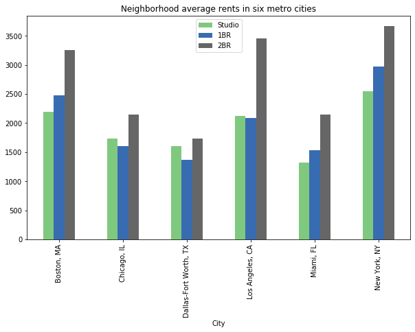
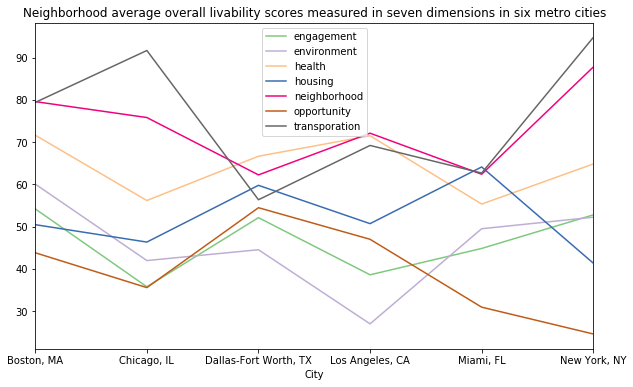
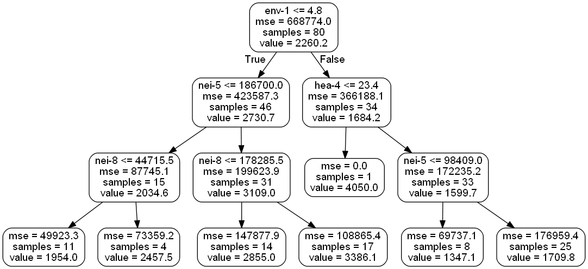

# Socio-Spatial Characteristics and Neighborhood Rent Predictions in Six US Metro Cities

----

*Corresponding author email: zhang.1977@osu.edu*

## Background

In general, people tend to adopt dwelling features (for example, interior features like number of bedrooms and bathrooms, furnishing conditions, views, and exterior features like building/community amenities and HOA services, and etc.) to predict rental prices. However, **socio-spatial features, including locations, demographics, social environments, transportation, and characteristics of neighborhood-built environments, could be determinant factors of rental prices besides rental properties themselves.** These factors may also associate with the values of developed or under-development lands. Particularly in dense areas/cities like Manhattan, commute and city life heavily affect people’s housing choices with low car mobilities compared to suburban areas.

Because of the lack of environmental data relating to rental market data, however, **most projects of rental price prediction have overlooked the environmental factors** that only tested the housing interior features and adding few of neighborhood features.

Therefore, the project has tested the importance of using the outside socio-spatial features under seven major categories (demographics, social engagement, natural environment, health service, neighborhood environments, living opportunities, and transportation conditions) to predict average rental prices for neighborhoods in six US metropolitan areas.

## Objective

**1. Predict average neighborhood rental prices based on the neighborhood soico-spatial features**

For the average neighborhood housing price, the individual apartment features would be less important compared with its location and outside environments. The prediction results could provide an insight to estimate the general rental market value through socio-spatial data without local investigations. Landlords and investors can use such information for decision making on investing or renovating rental properties in a certain neighborhood. Meanwhile, the prediction models can assist residents in housing choices. Moreover, as the project has tested neighborhoods in six cities, we may apply the method to other areas/cities based on different business demands.

**2. Identify the key environmental features for increase the neighborhood market values**

The project has examined over 40 types of socio-spatial features. It would help us to idenfity which of them affect the average neighborhood rents most and in which directions. The results also provided the insights for local government and committees for neighborhood improvement.

## Datasets

The project integrated the datasets from three sources: renthop open data for rents, AARP livability index API (https://livabilityindex.aarp.org/livability-sources) for socio-environmental features, and Google map API for location extractions that linked renthop data with AARP data.

**Target variable**

Average rental prices per neighborhoods in six metro cities: Boston, MA; Chicago, IL; Dallas-Fort Worth, TX; Los Angeles, CA; Miami, FL; New York, NY
Total sample (neighborhoods): 185

**Predictors**

The livability index contained two parts: overall livability ratings for seven categories and detailed feature ratings under each category. The overall ratings provided the weighted total scores measured from both feature metrics and policies; however, the detailed feature ratings were only generated from physical measurements/metrics without policies.

As the effects of policies (except housing policies) on rental prices were uncertain, the project splited the predictors to two groups: overall ratings (seven variables) and 43 detailed features including demographics.

(For variable list, see Appendix Table 1.)

## Methods

### Socio-spatial data acquiring and wrangling ###
The link below contained the data acquiring, integration and cleaning process.
https://github.com/totoroxin/rent_prediction_sandbox/blob/master/AARP_renthop_data_integration.ipynb

### Data Analyses and Visualization

The link below contained data analyses and modeling process.
https://github.com/totoroxin/rent_prediction_sandbox/blob/master/rent_neigh_analysis.ipynb

## Model selections and results
#### 1. Using overall livability ratings to predict neighborhood average rents
- The results from linear model showed the seven categories containing policy scores explained 47% variance of neighborhood average rents. Such broad categories would be not accurate predictors.

- The results from random forest model showed the prediction accuracy was 79.33% with seven predictors.

#### 2. Using detailed feature index to predict neighborhood average rents
As I consider the policy might not directly have effects on rents, and the existing physical conditions effected more on it, I extracted 43 detailed features from six categories (excluded housing cost itself) indcluding demographics to explore the individual effects.
- The results from three methods (random forest, Ada boosting, and gradient boosting) showed the 43 features provided 82%-84% accuracies to predict neighborhood average rents.

- The most important feature we observed was **neighborhood transit accessibility**.

An example of the top part of a single decision tree from the random forest:

- Model improving to reduce the number of features
I used a feature selection method for random forest model to find out the key features that could explain most of the variance. It turned out the number of features reduced to seven out of 43, and the prediction accuracy had improved to 83.2%. Although it was not a dramatic improvement, it effectively reduced the workload for neighborhood feature data collection in future.

## Conclusion
This project has demonstrated the way of **using socio-spatial characteristics to predict average neighborhood housing rental prices**. The results had documented over 80% accuracy that the outside environmental characteristics could predict the average neighborhood rents without using the apartment interior features. It indicated the location, social and neighborhood environments are the most important factors that affect the rental market among different areas, for example, transit accessibility. It would help investors, developers and residents to evaluate the rents associating with neighborhood values. 

The projected successfully **integrated different types of data, such as spatial and housing data, from three resources**. It also has compared several machine learning methods. Some of the distributions of socio-spatial features were skewed with high bias and low variance, but some of the distributions showed low bias and high variance. Therefore, the bagging methods and the boosting methods shared similar performance for this dataset.

## Appendix
*Table 1. Variable references*

| Predictor  | Variable name  | Category  | Metric  | Unit  |
|---|---|---|---|---|
| livability-engagement | liv-1  | Social Engagement  | feature+policy  | index  |
| livability-environment | liv-2  | Natural Environment  | feature+policy | index |
| livability-health  | liv-3  | Health Service and Conditions  | feature+policy | index  |
| livability-housing | liv-4 | Housing Accessibility and Affordability | feature+policy | index |
| livability-neighborhood | liv-5 | Neighborhood Environments | feature+policy | index |
| livability-opportunity | liv-6 | Societal Opportunities: equity, education, and generation | feature+policy | index |
| livability-transportation | liv-7 | Transportation Accessibility and Conditions | feature+policy | index |
| demographics-life_ex | dem-1 | Demographics | | |
| demographics-median_inc | dem-2 | Demographics | median income | dollar |
| demographics-pct_50plus | dem-3 | Demographics | percentage of people's age over 50 | percent |
| demographics-pct_65plus | dem-4 | Demographics | percentage of people's age over 65 | percent |
| demographics-pct_africa | dem-5 | Demographics | percentage of African American | percent |
| demographics-pct_asian | dem-6 |  Demographics | percentage of Asian | percent |
| demographics-pct_disabi | dem-7 | Demographics | percentage of Disabiblity | percent |
| demographics-pct_hispan | dem-8 | Demographics | percentage of Hispano | percent |
| demographics-pct_povert | dem-9 | Demographics | percentage of poverty| percent |
| demographics-total_popu | dem-10 | Demographics | number of total population| count |
| engagement-broadband cost and speed | eng-1 | Engagement | Percentage of residents who have access to three or more wireline Internet service providers, and two or more providers that offer maximum download speeds of 50 megabits per second: measured at the neighborhood scale, higher values are better | percent |
| engagement-cultural, arts, and entertainment | eng-2 | Engagement | Number of performing arts companies, museums, concert venues, sports stadiums, and movie theaters per 10,000 people: measured at the neighborhood scale, higher values are better | count |
| engagement-opportunity for civic involvement | eng-3 | Engagement | Number of civic, social, religious, political, and business organizations per 10,000 people: measured at the county scale, higher values are better | index |
| engagement-social involvement index | eng-4 | Engagement | Extent to which residents eat dinner with household members, see or hear from friends and family, talk with neighbors, and do favors for neighbors: measured at the metro area scale from 0 to 2, higher values are better | index |
| environment-air quality index | env-1 | Environment | Number of days per year when regional air quality is unhealthy for sensitive populations: measured at the county scale, lower values are better | days |
| environment-drinking water quality | env-2 | Environment | Percentage of the population getting water from public water systems with at least one health-based violation during the past year: measured at the county scale, lower values are better | percent |
| environment-local industrial pollution | env-3 | Environment | Toxicity of airborne chemicals released from nearby industrial facilities: measured at the neighborhood scale from 0 to 311,000, lower values are better | air toxicity index |
| environment-near-roadway pollution | env-4 | Environment | Toxicity of airborne chemicals released from nearby industrial facilities: measured at the neighborhood scale from 0 to 311,000, lower values are better | percent |
| health-access to exercise opportunities | hea-1 | Health | Percentage of people who live within a half-mile of parks and within 1 mile of recreational facilities (3 miles for rural areas): measured at the county scale, higher values are better | percent
| health-health professional shortage areas | hea-2 | Health | Severity of clinician shortage: measured at the health professional shortage area scale from 0 to 25, lower values are better | priority score |
| health-obesity prevalence | hea-3 | Health | Estimated obesity rate: measured at the county scale, lower values are better | percent |
| health-preventable hospitalization rate | hea-4 | Health | Number of hospital admissions for conditions that could be effectively treated through outpatient care per 1,000 patients: measured at the hospital service area scale, lower values are better | / 1,000 Medicare enrollees |
| health-tobacco use | hea-5 | Health | Estimated smoking rate: measured at the county scale, lower values are better | percent |
| neighborhood-access to grocery stores | nei-1 | Neighborhood | Number of grocery stores and farmers’ markets within a half-mile: measured at the neighborhood scale, higher values are better | counts |
| neighborhood-access to libraries | nei-2 | Neighborhood | Number of libraries located within a half-mile: measured at the neighborhood scale, higher values are better | counts |
| neighborhood-access to parks | nei-3 | Neighborhood | Number of parks within a half-mile: measured at the neighborhood scale, higher values are better | counts |
| neighborhood-activity density | nei-4 | Neighborhood | Combined number of jobs and people per square mile: measured at the neighborhood scale, higher values are better | jobs + people / sq. mi. |
| neighborhood-automobile accessibility | nei-5 | Neighborhood | Number of jobs accessible within a 45-minute automobile commute: measured at the neighborhood scale, higher values are better | jobs |
| neighborhood-crime rates | nei-6 | Neighborhood | Combined violent and property crimes per 10,000 people: measured at the county scale, lower values are better | crimes / 10,000 people |
| neighborhood-diversity of destinations | nei-7 | Neighborhood | Mix of jobs within a mile: measured at the neighborhood scale, higher values are better | diversity score (0-1 scale) |
| neighborhood-transit accessibility | nei-8 | Neighborhood | Number of jobs accessible within a 45-minute transit commute: measured at the neighborhood scale, higher values are better | jobs |
| neighborhood-vacancy rate | nei-9 | Neighborhood | Percentage of vacant housing units: measured at the neighborhood scale, lower values are better | percent |
| opportunity-age diversity | opp-1 | Opportunity | Age-group diversity of local population compared to the national population: measured at the neighborhood scale from 0 to 1, higher values are better | relative diversity |
| opportunity-high school graduation rate | opp-2 | Opportunity | Adjusted 4-year high school cohort graduation rate: measured at the school district scale, higher values are better | percent |
| opportunity-income inequality | opp-3 | Opportunity | Gini coefficient (the gap between rich and poor): measured at the county scale from 0 to 1, lower values are better | Gini coefficient |
| opportunity-jobs/worker | opp-4 | Opportunity | Number of jobs per person in the workforce: measured at the metro area scale, higher values are better. Jobs are capped at 1.0 job per person | jobs / worker |
| transportation-ADA-accessible stations | tra-1 | Transportation | Percentage of transit stations and vehicles that are ADA-accessible: measured at the metro area scale, higher values are better | percent |
| transportation-congestion | tra-2 | Transportation | Estimated total hours that the average commuter spends in traffic each year: measured at the metro area scale, lower values are better | hours |
| transportation-crash rates | tra-3 | Transportation | Annual average number of fatal crashes per 100,000 people: measured at the neighborhood scale, lower values are better | fatal crash counts |
| transportation-frequency of local transit service | tra-4 | Transportation | Total number of buses and trains per hour in both directions for all stops within a quarter-mile: measured at the neighborhood scale, higher values are better | buses and trains |
| transportation-household transportation costs | tra-5 | Transportation | Estimated household transportation costs: measured at the neighborhood scale, lower values are better | dollars |
| transportation-speed limits | tra-6 | Transportation | Average speed limit (MPH) on streets and highways: measured at the neighborhood scale, lower values are better | miles per hour |
| transportation-walk trips | tra-7 | Transportation | Estimated walk trips per household per day: measured at the neighborhood scale, higher values are better | trips |

## References
https://www.renthop.com/studies

https://livabilityindex.aarp.org/livability-sources 

https://towardsdatascience.com/feature-selection-using-random-forest-26d7b747597f

*Note: the author owns all copyright of this project.*
